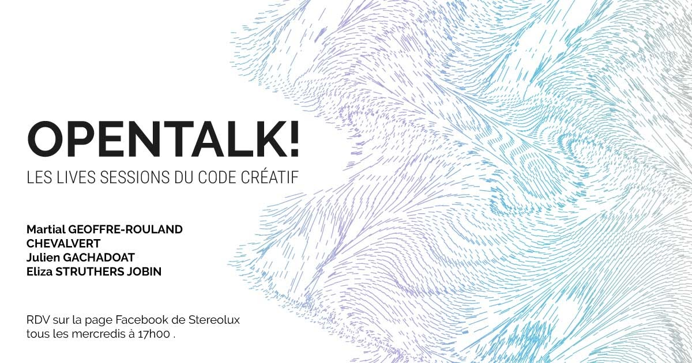
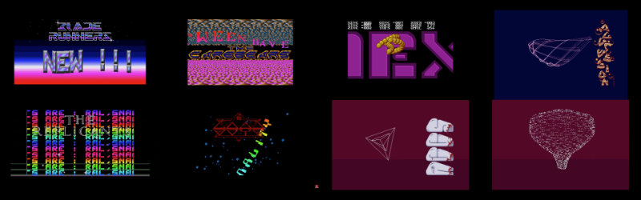

# OpenTalk!

 
Cette page présente les liens vers les références présentées en ligne lors de l'évènement OpenTalk le 6 mai 2020. 

## Début & Démomania

* [Stargoose Cracktro](https://www.youtube.com/watch?v=TrN5xsfBvHQ) / [Blade Runners](https://demozoo.org/groups/31439/) & [ST Computer Service](https://demozoo.org/groups/36386/) / 1988
* [Super-Multiplane-3D-Sine-Distorter-And-Whole-Lotta-Things-More-Scroller](https://youtu.be/comSfq97R9s?t=3296) / [The Carebears](https://demozoo.org/groups/2050/) / [The Union Demo](https://demozoo.org/productions/68152/) / 1989 *Creativity Cracking Pleasure*
* [The Megaball Demo](https://youtu.be/5pRelt_CPVk?t=4314) / [The Carebears](https://demozoo.org/groups/2050/) / Cuddly demos / 1989
* [Brain Damage](https://www.youtube.com/watch?v=EG0fk2o88xg) / Kruz & [Aggression](https://demozoo.org/groups/365/) / 1993
* [Soldier of Light cracktro](https://www.youtube.com/watch?v=m4YcjQ9j7Bw) / [The Replicants](https://demozoo.org/groups/31491/) / 1988
* [The Twiddle demo](https://youtu.be/nqHK4IQhtVo?t=1694) / [The Lost Boys](https://demozoo.org/groups/36386/) / Dark side of the spoon by [ULM](https://demozoo.org/groups/2274/) / 1991
* [Edge of Panic](https://www.youtube.com/watch?v=bkGBmBIFOaI) / [ACCS](https://demozoo.org/groups/32195/) / 1993

#### Liens
* [Démos et merveilles](http://www.codercorner.com/DemosEtMerveilles.htm) / Pierre Terdimand *Une introduction au petit monde de la démo* *A l'origine était le piratage. Au départ, quand un groupe de pirates crackait un nouveau jeu, son nom était affiché à l'écran durant le chargement.*

## 2Roqs
* [Site web 2Roqs](http://www.2roqs.com/) + [Vimeo](https://vimeo.com/tworoqs) + [Flickr](https://www.flickr.com/photos/2roqs/albums/)
* Installations typographiques : [Gravity](https://vimeo.com/3884343) / [Expression](https://vimeo.com/12399772) / [Textopolis](https://vimeo.com/39883474) / [Aquatypes](https://vimeo.com/28986231) / [Calligrammes](https://vimeo.com/116154639)
* [O mio babbino caro](https://vimeo.com/224324907)
* Collaborations : 
  * [La cité du vin](https://www.flickr.com/photos/2roqs/albums/72157670020909234) avec [Grand Angle](http://grandangle.com/).
  * [Les boites CAPC](http://www.lesboitescapc.fr/) avec [Kubik](http://www.kubik.fr/) et [Zamak](https://zamak.design/).
  * [Murmur](https://vimeo.com/67242728) avec [Chevalvert](http://www.chevalvert.fr/), [Polygraphik](http://polygraphik.com/) et [Splank](https://www.splankstudio.com/)
  * [360 000](https://vimeo.com/45195510) pour les Nuits sonores 2012 avec [Screen-Club](https://www.screen-club.com/) et [Looking for Achitecture](http://www.lookingforarchitecture.com/)

#### Liens
 * [ofxJavascript](https://github.com/v3ga/ofxJavascript) *Moteur JS intégrable à Openframeworks, avec en lien des références de projets utilisant cet add-on.*

## Code >> impressions
* [Algorithmes typographiques](http://lacleamolette.fr/ouvrage/algorithmes-typographiques/)
* [Processing Bordeaux](https://github.com/v3ga/Processing-Bordeaux-posters)
* [Ombrocessing](https://vimeo.com/267686259)

#### Liens
* [Evil Mad Science — Axidraw](https://axidraw.com/)
* [Generative Hut](https://www.generativehut.com/)
* [AATB — Practice for non-industrial robotics](http://www.aatb.ch/)
* [Atelier SerreJoint](https://www.atelierserrejoint.com/)
  * [sérigraphies Julien Gachadoat](https://www.atelierserrejoint.com/product-tag/julien-gachadoat/)
* [Outil atelier axidraw Stereolux](https://github.com/v3ga/Workshop_Processing_Axidraw_Stereolux_2019) *Code source de l'outil assemblé avec Processing qui a été montré pendant la visio.*

## Figures de l'art génératif
* [Georg Nees](http://dada.compart-bremen.de/item/agent/15)
* [Michaël Noll](http://dada.compart-bremen.de/item/agent/16)
* [Vera Molnar](http://www.veramolnar.com/)
* [Frieder Nake](http://dada.compart-bremen.de/item/agent/68)
* [Edward Zajec](http://edwardzajec.com/)
* [Wacław Szpakowski](https://www.theparisreview.org/blog/2017/02/15/rhythmical-lines/)

#### Liens
* [Recode project](http://www.recodeproject.com/)
* [Computer history](https://github.com/v3ga/computer_history)
